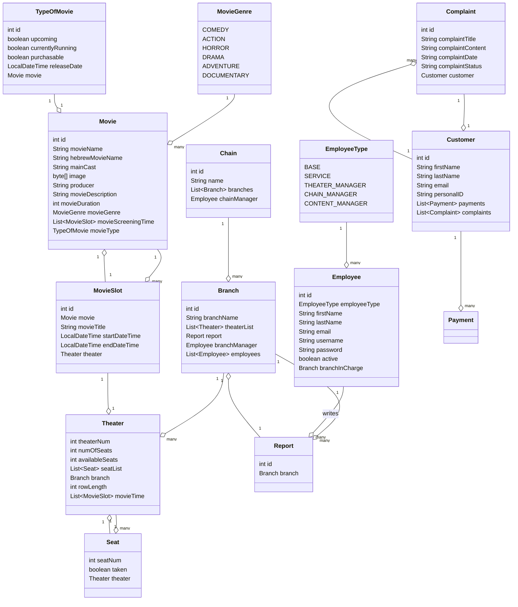
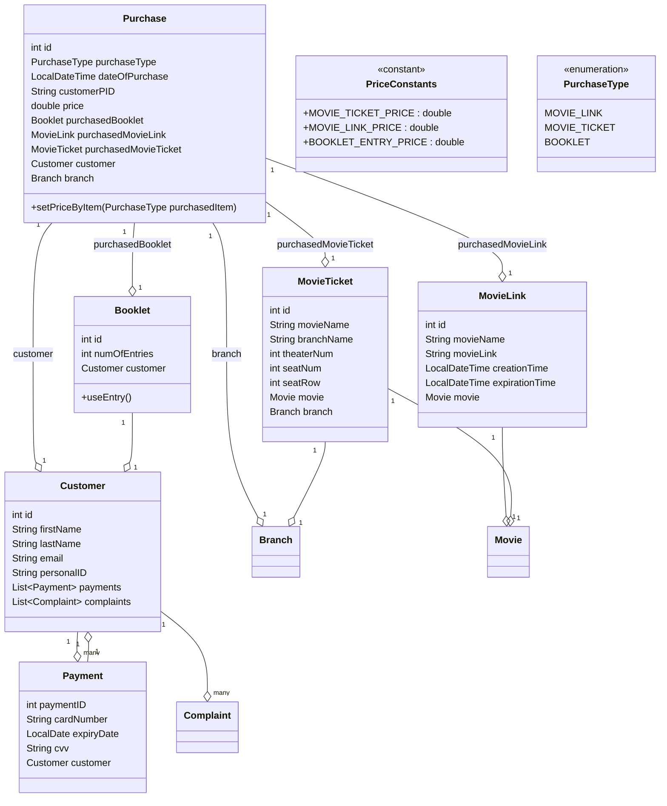

# Cinema Entities and Purchase Entities UML Diagram

## Table of Contents
- [UML Class Diagrams](#uml-class-diagrams)
  - [Cinema Entities](#cinema-entities)
  - [Purchase Entities](#purchase-entities)
- [Class Descriptions](#class-descriptions)
  - [Cinema Entities](#cinema-entities)
  - [Purchase Entities](#purchase-entities)
  - [Movie Details Entities](#movie-details-entities)
  - [User Entities](#user-entities)
  - [User Requests Entities](#user-requests-entities)

## UML Class Diagrams

### Cinema Entities
Below is the UML class diagram representing the cinema entities and their relationships:

### Purchase Entities
Below is the UML class diagram representing the purchase entities and their relationships:

## Class Descriptions

### Cinema Entities
    Branch: Represents a cinema branch.
    Chain: Represents a cinema chain.
    Seat: Represents a seat in a theater.
    Theater: Represents a theater in a branch.

### Purchase Entities
    PurchaseItem: Base class for items included in a purchase.
        - Attributes: id, price
        - Methods: +setPrice(double price)
    Booklet: Represents a booklet associated with a purchase.
        - Attributes: id, numOfEntries, price, customer
        - Methods: +useEntry()
    MovieTicket: Represents a ticket for a movie.
        - Attributes: id, price, movie, branch, movieName, branchName, theaterNum, seatNum, seatRow
    MovieLink: Represents a link to a movie.
        - Attributes: id, movie, movieName, movieLink, creationTime, expirationTime
    Payment: Represents a payment transaction.
        - Attributes: paymentID, cardNumber, expiryDate, cvv, price, customer
    Purchase: Represents a purchase, which can include multiple items and payments.
        - Attributes: id, purchaseType, dateOfPurchase, totalCost, movieTickets, payments, booklet
        - Methods: +calculateTotalCost()
    PurchaseType: Represents the type of purchase.
        - Values: MOVIE_LINK, MOVIE_TICKET, BOOKLET

### Movie Details Entities
    Movie: Represents a movie.
    MovieGenre: Represents the genre of a movie.
    MovieSlot: Represents a slot for a movie showing.
    TypeOfMovie: Represents the type of a movie.

### User Entities
    Customer: Represents a customer.
    Employee: Represents an employee.
    EmployeeType: Represents the type of an employee.

### User Requests Entities
    Complaint: Represents a complaint made by a customer.
    Report: Represents a report made by an employee.
