# Mock Data Explanation

## Branch: Main Branch
- **Branch Manager:** Jane Smith
- **Theater:** 3 (100 seats each)
  - **Seats:** 1 to 100

## Branch: Second Branch
- **Branch Manager:** Bob White
- **Theater:** 4 (100 seats each)
  - **Seats:** 1 to 100

## Branch: Third Branch
- **Branch Manager:** Alice Green
- **Theater:** 7 (100 seats each)
  - **Seats:** 1 to 100

## Branch: Fourth Branch
- **Branch Manager:** Chris Brown
- **Theater:** 4 (100 seats each)
  - **Seats:** 1 to 100

## Branch: Fifth Branch
- **Branch Manager:** Emma Blue
- **Theater:** 11 (100 seats each)
  - **Seats:** 1 to 100

## Movie: Inception
- **MovieSlot:** Inception (Now)

## Employees
- **Employee:** Joe Black (Service)
- **Employee:** Anna Blue (Content Manager)
- **Employee:** Mark Red (Base)
- **Employee:** Nina Yellow (Base)

## Customers
### Customer 1: Charlie Red
- **MovieTicket:** Inception, Seat 1 (2024-08-01 at Main Branch)
- **MovieTicket:** Interstellar, Seat 1 (2024-08-02 at Second Branch)
- **MovieTicket:** The Dark Knight, Seat 1 (2024-08-03 at Third Branch)
- **Complaint:** None

### Customer 2: Diana Yellow
- **MovieTicket:** Inception, Seat 1 (2024-08-01 at Fourth Branch)
- **MovieTicket:** Interstellar, Seat 1 (2024-08-02 at Fifth Branch)
- **MovieTicket:** The Dark Knight, Seat 1 (2024-08-03 at Main Branch)
- **Complaint:** None

### Customer 3: Eve Green
- **MovieTicket:** Inception, Seat 1 (2024-08-01 at Second Branch)
- **MovieTicket:** Interstellar, Seat 1 (2024-08-02 at Third Branch)
- **MovieTicket:** The Dark Knight, Seat 1 (2024-08-03 at Fourth Branch)
- **Complaint:** None

### Customer 4: Frank Blue
- **MovieTicket:** Inception, Seat 1 (2024-08-01 at Fifth Branch)
- **MovieTicket:** Interstellar, Seat 1 (2024-08-02 at Main Branch)
- **MovieTicket:** The Dark Knight, Seat 1 (2024-08-03 at Second Branch)
- **Complaint:** None

### Customer 5: Grace Brown
- **MovieTicket:** Inception, Seat 1 (2024-08-01 at Third Branch)
- **MovieTicket:** Interstellar, Seat 1 (2024-08-02 at Fourth Branch)
- **MovieTicket:** The Dark Knight, Seat 1 (2024-08-03 at Fifth Branch)
- **Complaint:** None

classDiagram
class Branch {
int id
String branchName
List~Theater~ theaterList
Employee branchManager
List~Employee~ employees
}
class Theater {
int id
int numOfSeats
int availableSeats
List~Seat~ seatList
Branch branch
int rowLength
List~MovieSlot~ movieTime
}
class Employee {
int id
EmployeeType employeeType
String firstName
String lastName
String email
String username
String password
boolean active
Branch branch
}
class Customer {
int id
String firstName
String lastName
String email
String personalID
List~Payment~ payments
List~Complaint~ complaints
List~MovieTicket~ movieTickets
}
class MovieTicket {
int id
String movieName
String branchName
int theaterNum
int seatNum
int seatRow
MovieSlot movieSlot
}
class MovieSlot {
int id
String movieTitle
LocalDateTime startDateTime
LocalDateTime endDateTime
Theater theater
}

```mermaid
classDiagram

    Branch "1" --o "many" Theater
    Branch "1" --o "many" Employee
    Branch "1" --o "many" Customer

    Customer "1" --o "many" MovieTicket
    Theater "1" --o "many" MovieSlot

    Branch --o Theater : contains
    Branch --o Employee : employs
    Branch --o Customer : serves

    Customer --o MovieTicket : buys

    class MainBranch {
        branchName = "Main Branch"
    }
    class SecondBranch {
        branchName = "Second Branch"
    }
    class ThirdBranch {
        branchName = "Third Branch"
    }
    class FourthBranch {
        branchName = "Fourth Branch"
    }
    class FifthBranch {
        branchName = "Fifth Branch"
    }

    class JaneSmith {
        firstName = "Jane"
        lastName = "Smith"
        email = "jane.smith@example.com"
        username = "janesmith"
        employeeType = EmployeeType.BRANCH_MANAGER
    }
    class BobWhite {
        firstName = "Bob"
        lastName = "White"
        email = "bob.white@example.com"
        username = "bobwhite"
        employeeType = EmployeeType.BRANCH_MANAGER
    }
    class AliceGreen {
        firstName = "Alice"
        lastName = "Green"
        email = "alice.green@example.com"
        username = "alicegreen"
        employeeType = EmployeeType.BRANCH_MANAGER
    }
    class ChrisBrown {
        firstName = "Chris"
        lastName = "Brown"
        email = "chris.brown@example.com"
        username = "chrisbrown"
        employeeType = EmployeeType.BRANCH_MANAGER
    }
    class EmmaBlue {
        firstName = "Emma"
        lastName = "Blue"
        email = "emma.blue@example.com"
        username = "emmablue"
        employeeType = EmployeeType.BRANCH_MANAGER
    }

    class CharlieRed {
        firstName = "Charlie"
        lastName = "Red"
        email = "charlie.red@example.com"
        personalID = "123456789"
    }
    class DianaYellow {
        firstName = "Diana"
        lastName = "Yellow"
        email = "diana.yellow@example.com"
        personalID = "987654321"
    }
    class EveGreen {
        firstName = "Eve"
        lastName = "Green"
        email = "eve.green@example.com"
        personalID = "456789123"
    }
    class FrankBlue {
        firstName = "Frank"
        lastName = "Blue"
        email = "frank.blue@example.com"
        personalID = "654321987"
    }
    class GraceBrown {
        firstName = "Grace"
        lastName = "Brown"
        email = "grace.brown@example.com"
        personalID = "321654987"
    }

    class Inception {
        movieName = "Inception"
        seatNum = 1
        seatRow = 1
    }
    class Interstellar {
        movieName = "Interstellar"
        seatNum = 1
        seatRow = 1
    }
    class TheDarkKnight {
        movieName = "The Dark Knight"
        seatNum = 1
        seatRow = 1
    }

    MainBranch -- JaneSmith
    MainBranch -- CharlieRed
    SecondBranch -- BobWhite
    SecondBranch -- DianaYellow
    ThirdBranch -- AliceGreen
    ThirdBranch -- EveGreen
    FourthBranch -- ChrisBrown
    FourthBranch -- FrankBlue
    FifthBranch -- EmmaBlue
    FifthBranch -- GraceBrown

    CharlieRed -- Inception : "Main Branch"
    CharlieRed -- Interstellar : "Second Branch"
    CharlieRed -- TheDarkKnight : "Third Branch"

    DianaYellow -- Inception : "Fourth Branch"
    DianaYellow -- Interstellar : "Fifth Branch"
    DianaYellow -- TheDarkKnight : "Main Branch"

    EveGreen -- Inception : "Second Branch"
    EveGreen -- Interstellar : "Third Branch"
    EveGreen -- TheDarkKnight : "Fourth Branch"

    FrankBlue -- Inception : "Fifth Branch"
    FrankBlue -- Interstellar : "Main Branch"
    FrankBlue -- TheDarkKnight : "Second Branch"

    GraceBrown -- Inception : "Third Branch"
    GraceBrown -- Interstellar : "Fourth Branch"
    GraceBrown -- TheDarkKnight : "Fifth Branch"
```

## DataCommunicationDB Class

### Methods

- **`getPassword()`**: Returns the password.
- **`setPassword(String password)`**: Sets the password.
- **`getSession()`**: Returns the current session.
- **`setSession(Session session)`**: Sets the current session.
- **`getSessionFactory(String password)`**: Returns the session factory using the provided password.
- **`printAllEntities()`**: Prints all entities.
- **`printBranchMovies(int branchId)`**: Prints all movies for a given branch.
- **`generateMovieList2()`**: Generates a list of movies (method 2).
- **`generateMovieList()`**: Generates a list of movies.
- **`assignTicketToCustomer(Customer customer, MovieTicket ticket, Session session)`**: Assigns a movie ticket to a customer.
- **`assignLinkToCustomer(Customer customer, MovieLink link, Session session)`**: Assigns a movie link to a customer.
- **`assignBookletToCustomer(Customer customer, Booklet booklet, Session session)`**: Assigns a booklet to a customer.
- **`getScreeningTimesByMovie(Session session, int movieId)`**: Retrieves movie screening times by movie ID.
- **`readImage(String imagePath)`**: Reads an image from the given path.
- **`getPrices()`**: Retrieves the price constants from the database.
- **`getMovieByID(int movieID)`**: Retrieves a movie by its ID.
- **`getMovieSlotByID(int movieSlotID)`**: Retrieves a movie slot by its ID.
- **`getTheaterByID(int theaterID)`**: Retrieves a theater by its ID.
- **`getTypeOfMovieByID(int movieTypeID)`**: Retrieves a type of movie by its ID.
- **`getSeatByID(int seatID)`**: Retrieves a seat by its ID.
- **`getBranches()`**: Retrieves all branches.
- **`copyMovieDetails(Movie target, Movie source)`**: Copies movie details from source to target.
- **`createNewMovie(Movie movieToAdd)`**: Creates a new movie.
- **`updateMovieDetails(Movie source)`**: Updates movie details from the source.
- **`updateMovieField(int movieId, Consumer<Movie> updater)`**: Updates a movie field using the provided updater.
- **`modifyMovieName(int movieID, String newMovieName)`**: Modifies the name of a movie.
- **`modifyMovieMainCast(int movieID, String newMainCast)`**: Modifies the main cast of a movie.
- **`modifyMovieProducer(int movieId, String newProducer)`**: Modifies the producer of a movie.
- **`modifyMovieDescription(int movieId, String newMovieDescription)`**: Modifies the description of a movie.
- **`modifyMovieDuration(int movieId, int newMovieDuration)`**: Modifies the duration of a movie.
- **`updateTypeOfMovieField(int typeId, Consumer<TypeOfMovie> updater)`**: Updates a type of movie field using the provided updater.
- **`modifyTypeOfMovieUpcoming(int typeId, boolean upcoming)`**: Modifies the upcoming status of a type of movie.
- **`modifyTypeOfMovieCurrentlyRunning(int typeId, boolean currentlyRunning)`**: Modifies the currently running status of a type of movie.
- **`modifyTypeOfMoviePurchasable(int typeId, boolean purchasable)`**: Modifies the purchasable status of a type of movie.
- **`modifyTypeOfMovieReleaseDate(int typeId, LocalDateTime releaseDate)`**: Modifies the release date of a type of movie.
- **`getCustomerByPersonalID(Session session, String personalID)`**: Retrieves a customer by their personal ID.
- **`updateMovieSlotField(int slotId, Consumer<MovieSlot> updater)`**: Updates a movie slot field using the provided updater.
- **`modifyMovieSlotStartTime(int slotId, LocalDateTime startTime)`**: Modifies the start time of a movie slot.
- **`modifyMovieSlotEndTime(int slotId, LocalDateTime endTime)`**: Modifies the end time of a movie slot.
- **`modifyMovieSlotBranch(int slotId, Branch branch)`**: Modifies the branch of a movie slot.
- **`modifyMovieSlotTheater(int slotId, Theater theater)`**: Modifies the theater of a movie slot.
- **`getMovieSlotsByBranch(int branchId)`**: Retrieves movie slots by branch ID.
- **`getMovieSlotsByBranchIDAndMovieID(int movieID, int branchID)`**: Retrieves movie slots by branch ID and movie ID.
- **`getBranchesByMovieID(int movieID)`**: Retrieves branches by movie ID.
- **`getMoviesByBranch(int branchId)`**: Retrieves movies by branch ID.
- **`deleteMovieById(int movieId)`**: Deletes a movie by its ID.
- **`createMockData()`**: Creates mock data.
- **`createBranchWithManager(String branchName, String firstName, String lastName, String email, String username)`**: Creates a branch with the given manager.
- **`createTheaterForBranch(Branch branch)`**: Creates a theater with the given branch.
- **`createSeatsForTheater(Theater theater)`**: Creates seats for the theater.
- **`createAdditionalEmployees(List<Branch> branches)`**: Creates additional employees for branches.
- **`addEmployeeToBranch(Branch branch, String firstName, String lastName, EmployeeType employeeType, String email, String username)`**: Adds an employee to a branch.
- **`createCustomersWithPurchases(List<Theater> theaters)`**: Creates customers with purchases.
- **`createCustomers()`**: Creates customers.
- **`assignTicketsToCustomers(List<Customer> customers, List<Theater> theaters)`**: Assigns tickets to customers.
- **`assignTicketsToCustomer(Customer customer, Theater theater1, Theater theater2, Theater theater3)`**: Assigns tickets to a customer for multiple theaters.
- **`createEmployee(String firstName, String lastName, EmployeeType employeeType, String email, String username)`**: Creates an employee.
- **`createCustomer(String firstName, String lastName, String email, String personalID)`**: Creates a customer.
- **`createMovieTicket(Theater theater, String movieName, String dateTime)`**: Creates a movie ticket.
- **`main(String[] args)`**: Main method for testing.
